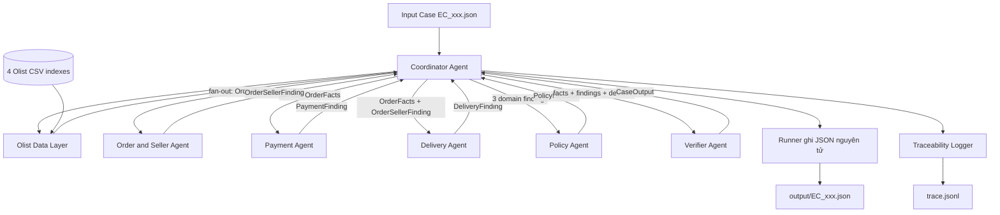
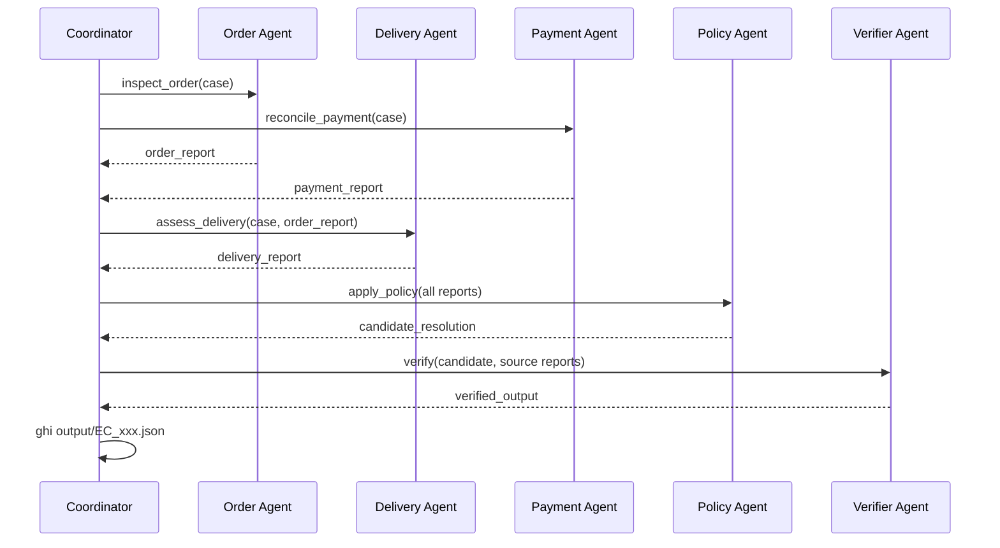

# Hướng dẫn hoàn thành nhiệm vụ Coordinator và kiến trúc hệ thống
## Project: Multi-Agent E-commerce Dispute Resolution (Olist Dataset)
**Lab:** K3 Day 09 - Multi-Agent A2A  
**Repo Path:** `D:\Vin20k\K3-Day9-Multi-Agent-A2A`  

Tài liệu này mô tả quy trình thực hiện phần việc **Coordinator + Kiến trúc hệ thống** mà không đi vào mã nguồn. Mục tiêu là bảo đảm các agent có trách nhiệm độc lập, có handoff thực sự và tạo được đúng 50 output có thể kiểm chứng.

---

## 1. System Overview & Multi-Agent Architecture

Hệ thống xử lý 50 case khiếu nại thương mại điện tử từ `EC_001.json` đến `EC_050.json` bằng kiến trúc **Multi-Agent Handoff & Specialist Collaboration**. Hệ thống phân tách thành 6 Agents chuyên biệt để đối chiếu dữ liệu Olist CSV, xác định bên chịu trách nhiệm, tính toán khoản hoàn tiền và tạo bằng chứng hợp lệ.

### Agent Roles & Permissions Matrix
| Agent | Vai trò chính | Thao tác dữ liệu (CSV) | Quyền hạn Output |
| :--- | :--- | :--- | :--- |
| **Coordinator Agent** | Nhận case, điều phối và tổng hợp | `CaseInput`, `OrderFacts` và các finding | Giao task, nhận handoff, trả `CaseOutput` |
| **Olist Data Layer** | Load CSV một lần và index theo `order_id` | `orders`, `order_items`, `order_payments`, `sellers` | `OrderFacts` là nguồn sự thật duy nhất |
| **Order & Seller Agent** | Kiểm tra trạng thái, item, seller và seller handoff | Chỉ dùng các trường order/item cần thiết trong `OrderFacts` | `OrderSellerFinding`, evidence `order:*`, `item:*`, `seller:*` |
| **Delivery Agent** | So sánh thời điểm giao với estimated date | Chỉ dùng timestamp và `OrderSellerFinding` | `DeliveryFinding` |
| **Payment Agent** | Đối soát payment và split payment bằng `Decimal` | Chỉ dùng item amount và payment rows | `PaymentFinding`, evidence `payment:*` |
| **Policy Agent** | Áp dụng `EC_POLICY_V1` đúng thứ tự ưu tiên | Ba domain finding, không đọc CSV | `PolicyDecision` |
| **Verifier Agent** | Ground entity/evidence, tính lại refund, chặn sai schema | Facts, findings và decision | `CaseOutput` đã xác minh |
| **Traceability Logger** | Ghi vết từng bước của lượt chạy mới nhất | Event từ Coordinator | Hai bản `trace.jsonl` đồng nhất |

---

## 2. Work Breakdown Structure (Phân công 5 Thành viên)

| STT | Thành viên & Vai trò | Phụ trách chính (Deliverables & Code) | Input nhận vào | Output bàn giao |
| :---: | :--- | :--- | :--- | :--- |
| **1** | **Thành viên 1** *Team Lead & Coordinator Architect* | - `coordinator.py` - `llm_client.py` - `main.py` - `architecture.md` - `metadata.json` | - File khiếu nại `input/EC_xxx.json` - Phản hồi từ các Domain Agents | - Khung hệ thống Multi-Agent - Luồng Handoff & Dispatcher - File `architecture.md` - File `metadata.json` |
| **2** | **Thành viên 2** *Data & Logistics Agent Engineer* | - `data_loader.py` - `agent_order_seller.py` - `agent_delivery.py` | - Data CSVs (`orders`, `order_items`, `sellers`, `customers`) | - Bằng chứng trạng thái đơn hàng - Đánh giá lỗi Seller giao trễ (`shipping_limit_date`) vs Lỗi Vận chuyển (`order_estimated_delivery_date`) |
| **3** | **Thành viên 3** *Payment & Financial Agent Engineer* | - `agent_payment.py` - `financial_utils.py` | - Data CSVs (`orders`, `order_items`, `order_payments`) | - Bảng đối soát tài chính (`item_total`, `freight_total`, `payment_total`) - Xác nhận Split Payment & Sai số |
| **4** | **Thành viên 4** *Business Policy Engine Engineer* | - `agent_policy.py` - `policy_rules.py` | - Báo cáo từ Order/Logistics Agent & Payment Agent | - Phân định `primary_issue` - Mã nguyên nhân `ranked_causes` - Trách nhiệm `responsible_parties` - Số tiền hoàn `recommended_refund_brl` |
| **5** | **Thành viên 5** *Verifier, Traceability & QA Engineer* | - `agent_verifier.py` - `trace_logger.py` - `packager.py` - 50 file `output/EC_xxx.json` | - Kết quả đề xuất từ Policy Agent - Toàn bộ log trao đổi của các Agent | - File `trace.jsonl` chạy 50 cases - 50 file `output/EC_xxx.json` đạt 100% Valid Schema & Evidence - File Zip nộp bài đúng chuẩn |

---

## 3. Business Rules Execution Flow (`EC_POLICY_V1`)

| Primary issue | Điều kiện kích hoạt | Responsible party | Refund | Action |
| :--- | :--- | :--- | ---: | :--- |
| `canceled_order_paid` | `order_status = canceled` và tổng payment > 0 | `platform` / `OLIST_PLATFORM` | Tổng payment | `issue_full_refund` |
| `unavailable_order_paid` | `order_status = unavailable` và tổng payment > 0 | `platform` / `OLIST_PLATFORM` | Tổng payment | `issue_full_refund` |
| `late_delivery_seller` | Giao sau `estimated_date` và carrier nhận hàng sau `shipping_limit_date` | `seller` / seller ID vi phạm | Tổng freight | `refund_freight` |
| `late_delivery_logistics` | Giao sau `estimated_date` và carrier nhận hàng không muộn hơn `shipping_limit_date` | `logistics_provider` / `LOGISTICS_PROVIDER` | Tổng freight | `refund_freight` |
| `valid_split_payment` | Có từ 2 payment row; tổng payment khớp tổng item + freight trong sai số 0.10 BRL | Không có | 0 | `explain_valid_split_payment` |
| `unsupported_late_claim` | Đơn giao không muộn hơn estimated date và payment khớp | Không có | 0 | `reject_late_refund` |

---

## 4. Verification Constraints & Output Schema Rules

- **Evidence IDs:** Định dạng bắt buộc `order:<id>`, `item:<order_id>:<item_id>`, `payment:<order_id>:<payment_seq>`, `seller:<seller_id>`, `policy:<root_cause_code>`.
- **Limits:** Max 5 entity IDs, 10 evidence IDs, 3 root causes, 3 responsible parties, 5 resolution actions.
- **Precision:** Mọi khoản tiền làm tròn 2 chữ số thập phân, `confidence` $\in [0, 1]$.

---

## 5. Nguyên tắc thiết kế Coordinator

Coordinator chỉ điều phối, không trực tiếp kết luận nghiệp vụ từ CSV. Việc phân tách này giúp hệ thống thể hiện đúng kiến trúc multi-agent thay vì đặt nhiều tên agent nhưng xử lý tập trung tại một nơi.

Các nguyên tắc bắt buộc:

1. Mỗi agent chỉ đọc dữ liệu thuộc domain của mình.
2. Kết quả trao đổi giữa các agent phải là report có cấu trúc.
3. Policy Agent chỉ ra quyết định từ các report đã nhận.
4. Verifier Agent là cổng bắt buộc trước khi ghi output.
5. Coordinator không tự tạo evidence hoặc sửa kết luận của agent một cách âm thầm.
6. Khi một agent lỗi, case phải dừng và ghi trace; không sinh output phỏng đoán.

## 6. Contract handoff giữa các agent

Mỗi task do Coordinator gửi cần có tối thiểu:

| Trường | Ý nghĩa |
| :--- | :--- |
| `case_id` | Mã case đang xử lý |
| `task_type` | Loại nhiệm vụ được giao |
| `payload` | Input case hoặc report từ bước trước |
| `policy_version` | Phiên bản chính sách cần áp dụng |

Mỗi report trả về cần có tối thiểu:

| Trường | Ý nghĩa |
| :--- | :--- |
| `case_id` | Phải trùng case đầu vào |
| `agent` | Agent tạo report |
| `status` | `completed` hoặc `failed` |
| `facts` | Các dữ kiện đã xác minh |
| `evidence_ids` | Evidence dựng trực tiếp từ CSV |
| `errors` | Danh sách lỗi nếu xử lý thất bại |

Handoff cụ thể:

1. Order Agent nhận input case và `claimed_order_id`.
2. Payment Agent nhận input case và có thể chạy song song với Order Agent.
3. Delivery Agent nhận input case cùng Order report để dùng đúng order và item đã xác minh.
4. Policy Agent nhận Order report, Delivery report và Payment report.
5. Verifier Agent nhận candidate resolution cùng toàn bộ source report.
6. Coordinator chỉ nhận output cuối khi Verifier xác nhận hợp lệ.

## 7. Luồng xử lý một case

Quy trình chi tiết:

1. Đọc input và kiểm tra `case_id`, `customer_request.claimed_order_id`, `policy_version`.
2. Giao Order Agent và Payment Agent xử lý độc lập.
3. Chuyển Order report cho Delivery Agent.
4. Chuyển ba domain report cho Policy Agent theo đúng thứ tự ưu tiên của `EC_POLICY_V1`.
5. Chuyển candidate resolution cho Verifier Agent.
6. Kiểm tra `case_id` trong output trùng input.
7. Ghi output bằng file tạm rồi đổi tên để tránh JSON dở dang.
8. Ghi trace cho dispatch, handoff, completed hoặc failed.

## 8. Pipeline xử lý 50 case

Pipeline tổng thể thực hiện theo thứ tự sau:

1. Quét thư mục `input/` và sắp xếp từ `EC_001` đến `EC_050`.
2. Kiểm tra không thiếu case và không có case ngoài phạm vi chính thức.
3. Xóa nội dung trace của lượt chạy cũ trước khi bắt đầu lượt mới.
4. Xử lý tuần tự từng case để lỗi và trace dễ truy vết.
5. Trong mỗi case, Order Agent và Payment Agent có thể chạy song song.
6. Chỉ ghi `output/EC_xxx.json` sau khi Verifier chấp thuận.
7. Nếu một case lỗi, ghi rõ agent và nguyên nhân; không tạo output giả để đủ số lượng.
8. Sau khi hoàn tất, xác nhận có đúng 50 JSON và không có file lạ trong `output/`.

## 9. Quy trình tổng hợp output JSON

Coordinator nhận kết quả đã xác minh và kiểm tra đủ bảy nhóm trường:

1. `case_id`
2. `assessment`
3. `affected_entities`
4. `root_cause_analysis`
5. `evidence_ids`
6. `financial_resolution`
7. `resolution_actions`

Quy tắc tổng hợp:

- Entity IDs được lấy từ source report, không suy diễn.
- Root cause và responsible party do Policy Agent quyết định.
- Evidence được hợp nhất, loại trùng và giữ đúng định dạng.
- Financial resolution lấy từ Payment report và refund do Policy Agent đề xuất.
- `case_status` là `action_required` khi refund lớn hơn 0; ngược lại là `no_action`.
- Mọi giá trị tiền được làm tròn hai chữ số thập phân.
- Output không được vượt các giới hạn số lượng của đề bài.

## 10. Trace và xử lý lỗi

Mỗi trace record nên chứa:

- Timestamp.
- `case_id`.
- Tên agent.
- Loại sự kiện.
- Loại task.
- Trạng thái xử lý.
- Thông tin lỗi đã loại bỏ secret.

Coordinator phải chặn các trường hợp:

- Thiếu hoặc sai tên input case.
- `case_id` trong JSON không khớp tên file.
- Agent trả dữ liệu không có cấu trúc.
- Agent lỗi hoặc hết thời gian xử lý.
- Verifier trả sai `case_id`.
- Output thiếu trường bắt buộc.
- Evidence, entity, cause, party hoặc action vượt giới hạn.

Không được bỏ qua lỗi và ghi candidate chưa được xác minh.

## 11. Quy trình tích hợp với các thành viên

1. Thống nhất contract report trước khi ghép các module.
2. Mỗi thành viên cung cấp một report mẫu cho agent mình phụ trách.
3. Dùng report mẫu để kiểm tra luồng handoff trước khi có đủ agent thật.
4. Tích hợp lần lượt Order, Delivery, Payment, Policy và Verifier.
5. Chạy một case đại diện cho từng `primary_issue`.
6. Kiểm tra các case nhiều item, nhiều seller và split payment.
7. Chạy đủ 50 case và kiểm tra trace của lượt chạy mới nhất.
8. Chỉ đóng gói `output/` sau khi toàn bộ case qua Verifier.

## 12. Checklist nghiệm thu

### Kiến trúc

- [ ] Mỗi agent có vai trò và quyền truy cập rõ ràng.
- [ ] Coordinator không chứa quy tắc domain.
- [ ] Handoff dùng report có cấu trúc.
- [ ] Có sơ đồ tổng thể và sequence xử lý một case.

### Pipeline

- [ ] Phát hiện đúng `EC_001` đến `EC_050`.
- [ ] Mỗi input tạo đúng một output cùng tên.
- [ ] Lượt chạy mới không append trace cũ.
- [ ] Lỗi agent không tạo output chưa xác minh.

### Output

- [ ] Schema có đủ trường bắt buộc.
- [ ] Evidence ID dựng trực tiếp từ CSV.
- [ ] Entity, cause, party và action không vượt giới hạn.
- [ ] Tổng tiền và refund được làm tròn hai chữ số.
- [ ] Có đúng 50 JSON trong `output/` và không có file lạ.

### Nộp bài

- [ ] `architecture.md` nằm ở root repo.
- [ ] `trace.jsonl` là trace của lượt chạy 50 case gần nhất.
- [ ] `metadata.json` khai báo model, parameter size, framework và runtime.
- [ ] Không commit `.env`, API key, token hoặc secret.
- [ ] File zip chỉ chứa nội dung thư mục `output/`.

## 13. Tiêu chí hoàn thành phần Coordinator

Phần việc được xem là hoàn thành khi:

- Luồng agent đúng thứ tự và có handoff thực sự.
- Order và Payment xử lý độc lập; Delivery phụ thuộc Order report.
- Policy chỉ kết luận từ report đã thu thập.
- Verifier là cổng bắt buộc trước khi ghi output.
- Pipeline phát hiện thiếu case và không tạo dữ liệu giả.
- 50 output có tên đúng, schema đúng và truy vết được qua trace.
